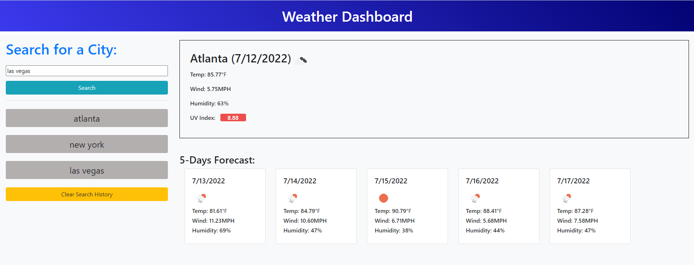

# weatherDashboard

## Link to the deployed application
https://kbjss071.github.io/weatherDashboard/

## To-do list
- Weather dashboard with form inputs should return current and future weather conditions for a given city and the city has to be added to history.
- The current weather conditions has to include the city name, the date, an icon representation of weather conditions, the temperature, the humidity, the wind speed, and the UV index.
- The UV index should indicate whether the conditions are favorable, moderate, or severe.
- The future weather conditions for the city should display the date, an icon representation of weather conditions, the temperature, the wind speed, and the humidity of a 5-day forecast.
- When the search history is clicked, the current and future weather conditions for the clicked city should be displayed.

## Works done in this project
- Built index.html to have a searching form.
- Designed the weather dashboard by writing style.css.
- Fetched two APIs provided by OpenWeatherMap to get weather information in a city.
- With the afforded information, create a result box for current weather condition in city as well as 5 card boxes for 5 days forecasting in city.
- Given a city prompted by user, it displays temperature, wind speed, humidity and UV index with a color how serious the index is
- Every prompted city is stored in local storage and it returns as a button element with text and id which are named as the prompted city.
- Once the button element is clicked, the browser displays the city's weather conditions again.